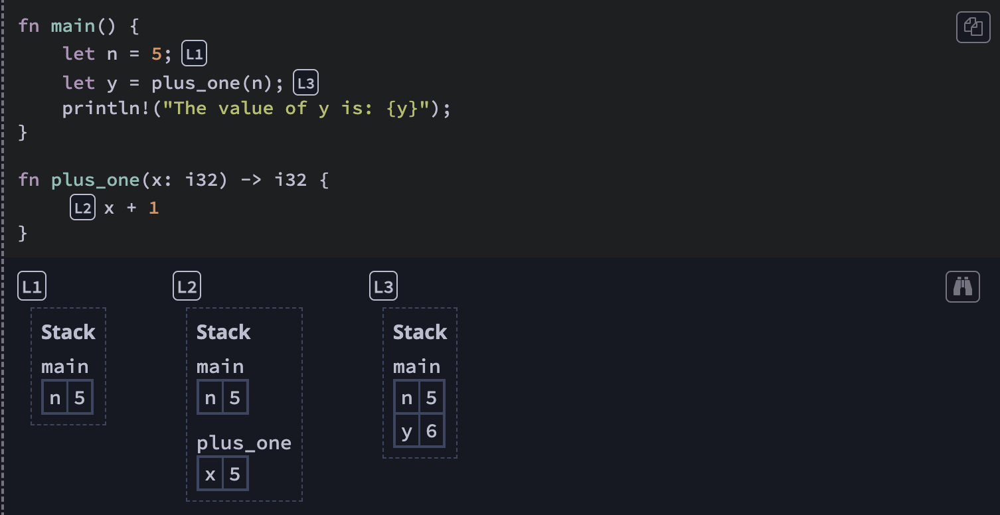
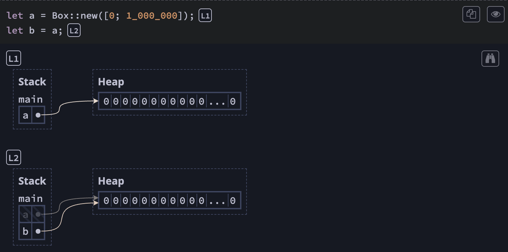

# Important notes: "Understanding Ownership"

## What is Ownership?

- Ownership is a discipline for ensuring the safety of Rust programs.
- A foundational goal of Rust is to ensure that your programs never have `undefined behavior`. That is the meaning of "safety".
- A secondary goal of Rust is to prevent `undefined behavior` at **compile-time** instead of **run-time**!

## Stack vs Heap

- Variables live in frames, and frames are organized into a stack of currently-called-functions and this sequence of frames is called a **stack**
- To transfer access to data without copying it, Rust uses **pointers** and it is a value that describes `a location in memory`.
The value that a pointer points-to is called its **pointee**
- One common way to make a pointer is to allocate memory in the heap. The heap is a separate region of memory where data can live indefinitely.

